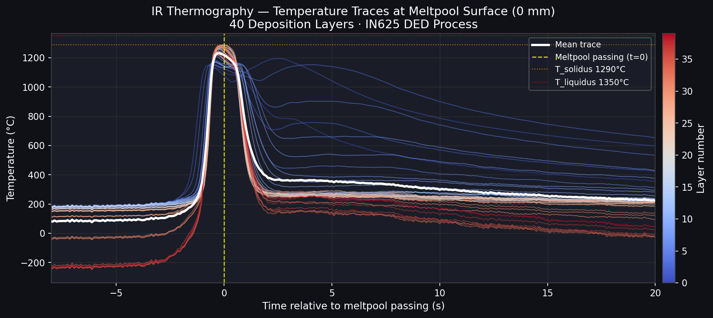
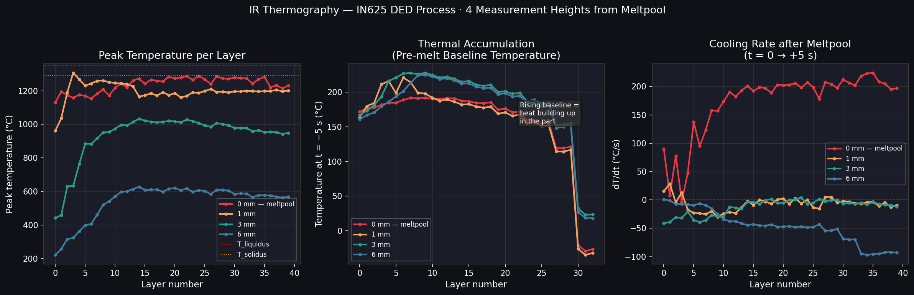
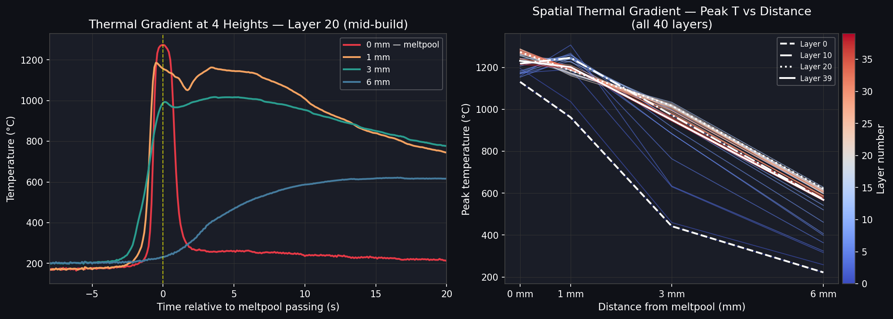
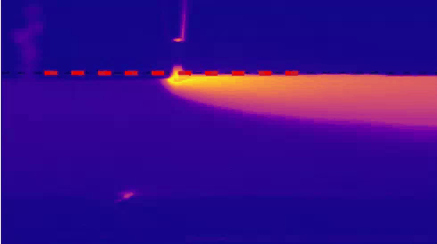
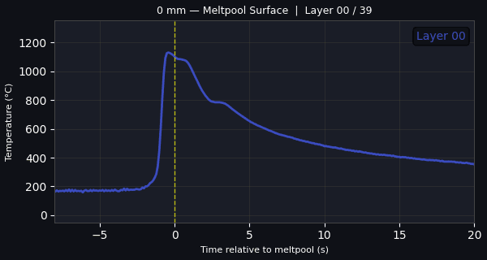
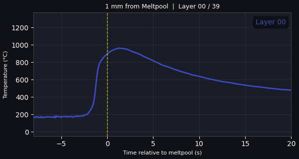
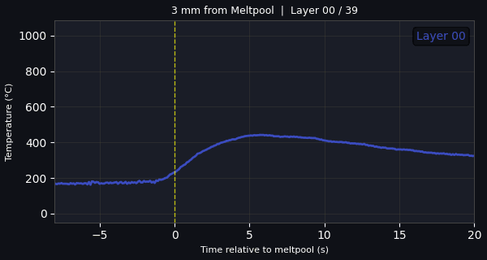
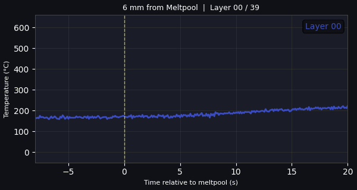

# DED Thermography Analysis - IN625 Inconel

IR thermography of a live **Directed Energy Deposition (DED)** additive manufacturing process.
Thermal data from an **InfraTec IRBIS 3** camera was processed and used to validate **FEM thermal simulations** of the meltpool and heat-affected zone.

**Material:** IN625 (Inconel 625) · **Layers:** 40 · **Measurement heights:** 0, 1, 3, 6 mm from meltpool

---

## Analytics

### Temperature Traces at the Meltpool Surface
All 40 deposition layers overlaid. Colour gradient blue to red shows layer progression.
The meltpool peak temperature ranges from **1131-1288 °C**, consistent with IN625 near its liquidus (1350 °C).

---

### Thermal Gradient, Accumulation and Cooling Rate
Three key metrics extracted per layer across all 4 measurement heights:

- **Left** - Peak temperature per layer: meltpool surface saturates near liquidus; deeper measurements show a rising trend due to thermal accumulation
- **Centre** - Pre-melt baseline temperature: rises monotonically, revealing heat building up in the part between deposition passes
- **Right** - Cooling rate: drops significantly with layer number as the growing part geometry reduces heat conduction to the substrate

---

### Spatial Thermal Gradient
- **Left** - Single-layer cross-section: temperature trace at each measurement height for Layer 20 (mid-build). Shows how rapidly temperature drops away from the meltpool.
- **Right** - Peak temperature vs distance from meltpool for all 40 layers. Later layers (red) are hotter at every depth due to accumulated heat.

---

## What the data reveals

| Observation | Physical meaning |
|---|---|
| Meltpool peak ~1131-1288 °C | Laser parameters consistent; meltpool controlled near IN625 liquidus |
| Rising pre-melt baseline (Layer 0 to 39) | Inter-layer thermal accumulation - part retains heat |
| Decreasing cooling rate in later layers | Growing geometry reduces thermal conduction to substrate |
| Sharp temperature drop with distance | Steep spatial gradient - confirms localised heat input |

---

## Demo - Live IR Feed

---

## Demo - Temperature Traces (40 Deposition Layers)

| 0 mm - Meltpool Surface | 1 mm from Meltpool |
|---|---|
|  |  |

| 3 mm from Meltpool | 6 mm from Meltpool |
|---|---|
|  |  |

<!-- _ka:2 -->
